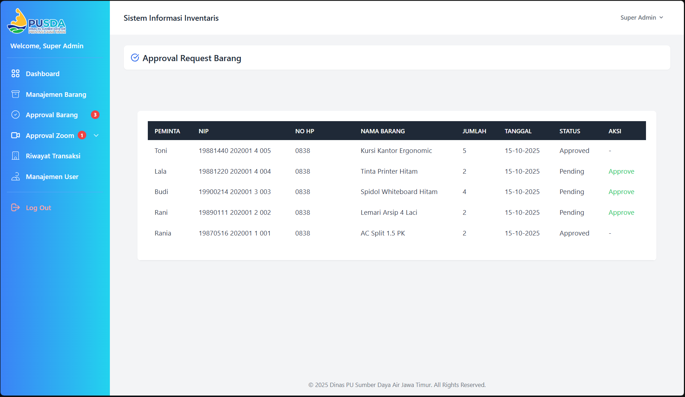
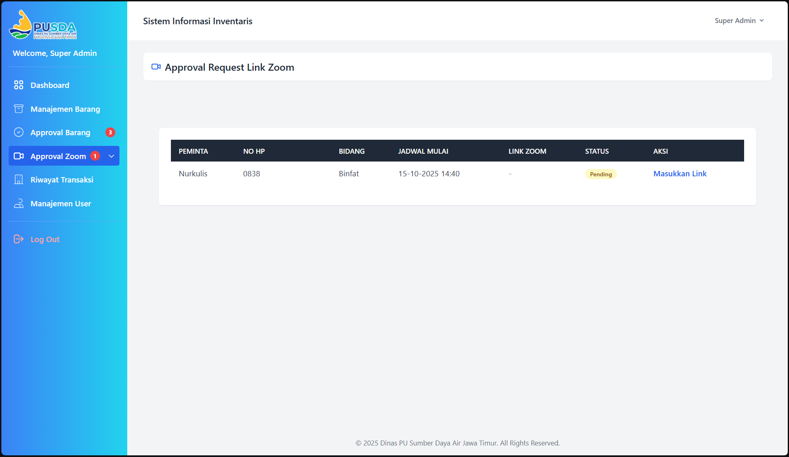

<p align="center">
  
</p>

## Web Inventaris Gudang – PUSDA

Aplikasi manajemen inventaris gudang dengan dukungan permintaan barang oleh tamu (guest) tanpa login dan fitur persetujuan admin, termasuk request Link Zoom dan notifikasi WhatsApp berbasis bidang.

---

### Spesifikasi Teknis
- **Framework**: Laravel 10 (PHP 8.2)
- **Database**: MySQL/MariaDB
- **Frontend**: Blade, Tailwind CSS
- **Auth & Role**: `super_admin`, `admin_barang`
- **Ekspor**: Maatwebsite/Excel
- **Notifikasi WhatsApp**: Fonnte API

---

### Fitur Utama
- **Guest Request Barang**: Tamu dapat mengajukan permintaan barang tanpa login (nama, NIP opsional, no HP, bidang, pilihan barang sesuai stok).
- **Guest Request Link Zoom**: Tamu dapat ajukan request Link Zoom (jadwal mulai/selesai, keterangan, bidang). Admin menambahkan link sebelum approve.
- **Dashboard Admin**:
  - Kartu ringkas: total item, request barang pending, request Zoom pending, jumlah transaksi masuk, jumlah transaksi keluar.
  - Tabel “Stok Menipis” (stok < 10, 10 item terendah) dengan indikator kritis/rendah.
- **Approval Barang & Zoom**: Admin menyetujui permintaan sesuai bidangnya.
- **Notifikasi WhatsApp**: Otomatis mengirim ke admin bidang terkait saat ada request (barang/Zoom) baru.
- **Manajemen Pengguna**: Tambah user dengan pilihan `bidang` dari tabel `bidang` dan kolom `no_hp` (untuk WA).
- **Transaksi**: 
  - Keluar: tercatat dari approval request barang (menyimpan `request_id`).
  - Masuk: saat membuat barang baru/menambah stok menyimpan `user_id` admin pelaksana.
- **Ekspor Excel**: Riwayat transaksi termasuk nama peminta (keluar) atau admin (masuk).

---

### Struktur Data Inti (Ringkas)
- `items` (barang: nama, kode, satuan, jumlah, lokasi)
- `request_barang` (permintaan barang: item, jumlah, status, nama_pemohon, nip, no_hp, bidang_id, user_id nullable)
- `bidang` (master bidang: nama)
- `request_linkzoom` (nama_pemohon, nip, no_hp, bidang_id, jadwal_mulai/selesai, keterangan, link_zoom nullable, status)
- `transactions` (request_id nullable, item_id, user_id nullable, jumlah, tipe masuk/keluar, tanggal)
- `users` (name, email, password, role, bidang string, no_hp nullable)

Relasi penting:
- `ItemRequest` → `item` (belongsTo), `bidang` (belongsTo)
- `RequestLinkZoom` → `bidang` (belongsTo)
- `Transaction` → `item` (belongsTo), `request` (belongsTo), `user` (belongsTo)

---

### Alur Operasional
1) **Guest – Dashboard Publik (`/`)**
   - Pilih: “Request Barang” atau “Request Link Zoom”.
2) **Guest – Request Barang**
   - Isi: nama, NIP (opsional), no HP, bidang, pilih barang (hanya stok tersedia), jumlah.
   - Sistem kirim notifikasi WA ke admin bidang terkait.
   - Status awal: pending.
3) **Guest – Request Link Zoom**
   - Isi: nama, NIP (opsional), no HP, bidang, jadwal mulai/selesai, keterangan.
   - Admin menambahkan `link_zoom` terlebih dahulu → baru bisa approve.
   - WA terkirim ke admin bidang terkait saat request dibuat.
4) **Admin – Approval**
   - Admin bidang melihat request bidangnya; super admin melihat semua.
   - Approve barang → stok barang berkurang, tercatat transaksi keluar (mengacu `request_id`).
   - Approve Zoom → hanya jika `link_zoom` sudah diisi.
5) **Transaksi**
   - Masuk: dibuat otomatis saat admin menambah barang baru/menambah stok, menyimpan `user_id` admin.
   - Keluar: dibuat saat approve request barang, menyimpan `request_id` untuk menampilkan nama peminta.
6) **Dashboard**
   - Kartu ringkasan + Tabel stok menipis (10 terendah, < 10).
7) **Ekspor**
   - Menu Riwayat Transaksi → Export Excel (memuat nama peminta/admin dan bidang pemohon).

---

### Instalasi & Konfigurasi
1) Clone & Install
```
composer install
cp .env.example .env
php artisan key:generate
```
2) Konfigurasi Database di `.env`, lalu migrasi & seeder:
```
php artisan migrate --seed
```
3) Konfigurasi Fonnte (WhatsApp)
```
FONNTE_TOKEN=ISI_TOKEN_ANDA
```
4) Aktifkan ekstensi PHP yang diperlukan (Windows – php.ini):
- extension=gd (untuk Excel/PhpSpreadsheet)
- extension=zip, extension=mbstring, extension=fileinfo
5) Jalankan aplikasi
```
php artisan serve
```

---

### Role & Akses
- `super_admin`: akses penuh (semua data, approval, master data).
- `admin_barang`: terbatas pada bidangnya (approval, transaksi terkait bidang).
- Guest (tanpa login): hanya halaman publik (request barang/Zoom, lihat stok).

---

### Navigasi & Menu
- Publik: `Welcome` → Request Barang, Request Link Zoom, Lihat Stok.
- Admin Sidebar: Approval Barang, Approval Zoom (Approval, Master Pesan), Items, Users, Transaksi, Dashboard.

---

### Placeholder Screenshot
- Dashboard:
```

```
- Approval Request Barang:
```

```
- Approval Link Zoom:
```

```


---

